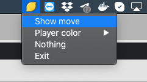

## Stockcheater

[Keras](https://www.tensorflow.org/guide/keras) + 
[Stockfish](https://github.com/official-stockfish/Stockfish) based assistant 
to suggest your better moves when playing chess.


### FAIRPLAY NOTE

**Using of this application when playing real games online is 
HIGHLY DISCOURAGED.
My suggestion is to use it for educational purposes, so please think twice
before spoiling a day for an opponent.**


### Recognize board on the screen

1. Collect as many images for pieces from any pieces sets displayed on a screen
with `grab_pieces.py`
2. Generate dataset from images after you have sorted pictures manually within
`pieces` directory. Make sure to have at least 10 examples to each type of piece
and then launch `create_dataset.py`
3. Train Keras model on your dataset with `recognizer.py`

### Launch move advisor

1. Open application
```bash
$ python main.py
```

2. Launch game on your favourite game platform (e.g. [lichess](https://lichess.org/))

3. When you need a hint just click on a tray icon as shown below




### todo

* Handle `0-0` and `0-0-0` conversion to [FEN](https://en.wikipedia.org/wiki/Forsyth%E2%80%93Edwards_Notation)
* Add color autodetection
* Add board position and size autodetection without hardcoding them in config
* Tune move suggestion to obtain couple of different lines
* Optimize performance?

